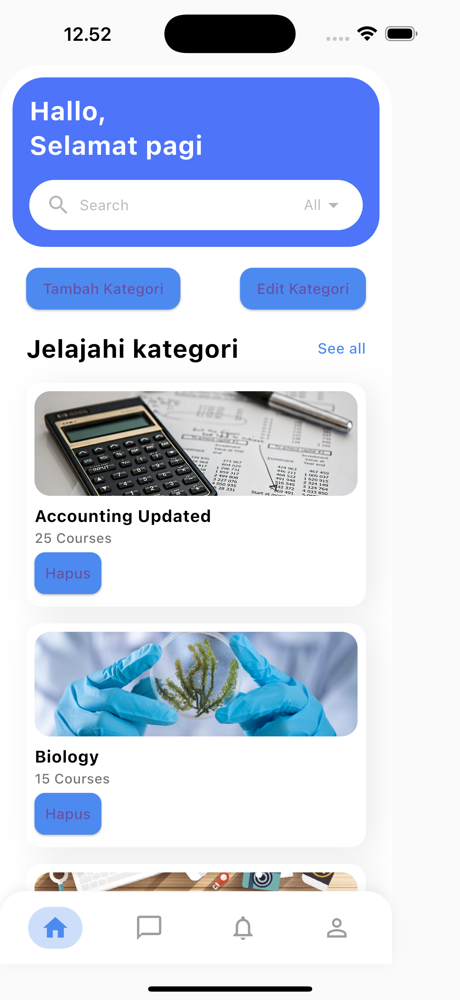
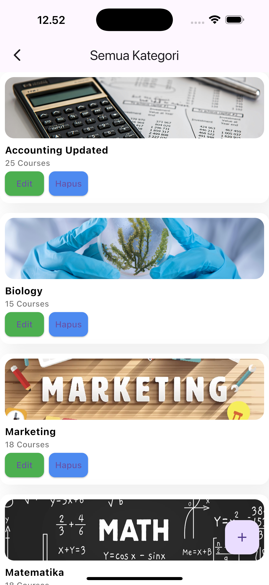

# 🚀 My Learning App - Flutter


**Project Tugas Akhir Mata Kuliah Pemrograman II**  
Semester 2 – Prodi Ilmu Komputer  

Aplikasi mobile **e-learning sederhana** berbasis Flutter (Dart) yang dibuat sebagai tugas akhir mata kuliah Pemrograman II.  
Fokus aplikasi: **CRUD kategori kursus, navigasi bottom bar, search & filter**, serta tampilan interaktif yang menarik.

---

## 🌟 Fitur Utama
- Menampilkan daftar kategori kursus (Accounting, Biology, Programming, AI, dll.)  
- **CRUD Kategori**
  - Tambah kategori baru
  - Edit kategori (judul, jumlah courses, gambar)
  - Hapus kategori
- **Navigasi Bawah (Bottom Navigation Bar)**
  - Home / Beranda
  - Chat / Message
  - Notifikasi
  - Profile
- **Search bar** dan filter kategori
- Halaman “See All” untuk menampilkan semua kategori kursus

---

## 📱 Screenshot
**1. Tampilan Beranda / Home**  
---


**2. Tampilan Kategori / See All**  
---


---


---

## ⚡ Cara Menjalankan Aplikasi
1. Install Flutter: [Flutter Install Guide](https://flutter.dev/docs/get-started/install)  
2. Clone repository:
```bash
git clone https://github.com/rasidi3112/my-learning-app.git

-

cd my-learning-app

-

cd rasidi_figma_izak

-

flutter pub get

-

flutter run


